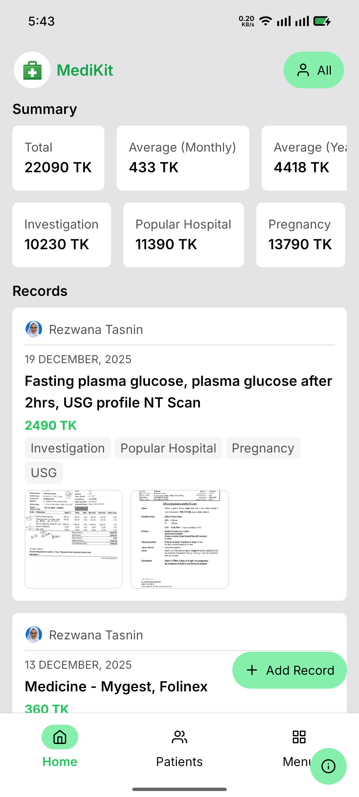
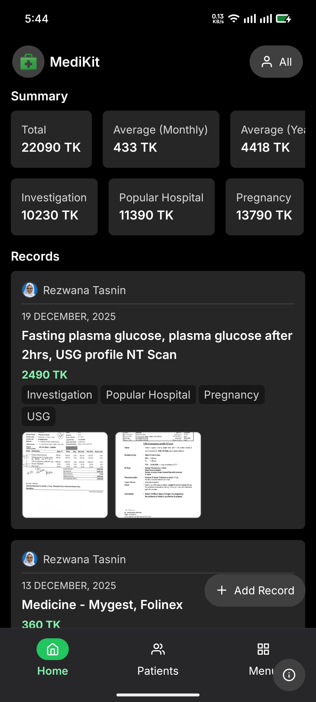

# Medikit

**Medikit** is a privacy-first mobile application for managing medical histories, prescriptions, and receipts. All data is stored entirely on-device using MMKV for fast, local storage. The app provides optional Google Drive backup functionality, giving you complete control over your sensitive medical information without relying on external servers or shared databases.

## Screenshots

<div style="display: flex; gap: 16px; flex-wrap: wrap;">
  <div>
    
    <p style="text-align: center; margin-top: 8px;"><strong>Light Mode</strong></p>
  </div>
  <div>
    
    <p style="text-align: center; margin-top: 8px;"><strong>Dark Mode</strong></p>
  </div>
</div>

## Features

### Core Functionality

- **Patient Management**
  - Create and manage multiple patient profiles
  - Add patient information including name, date of birth, and profile photos
  - Switch between patients to view their individual medical records
  - Patient-specific record filtering and organization

- **Medical Records Management**
  - Capture medical visits with detailed information:
    - Doctor/clinic information
    - Visit notes and descriptions
    - Visit dates
    - Medical expenses/amounts
    - Custom tags for categorization
  - Attach multiple images per record (prescriptions, receipts, lab reports, etc.)
  - View records chronologically with sorting by date
  - Edit and delete existing records
  - Records summary with statistics

- **File Attachments**
  - Attach photos from gallery or camera
  - Support for multiple attachments per record
  - Automatic file management and cleanup
  - Support for various image formats

### Data Storage & Privacy

- **Local-First Architecture**
  - All data stored locally using MMKV (fast key-value storage)
  - No backend servers or external databases
  - Complete data ownership and privacy
  - Fast, offline-first experience

- **Google Drive Backup (Optional)**
  - One-tap backup to your personal Google Drive
  - Automatic creation of a private `Medikit Backups` folder
  - Zips JSON data and all attachments before upload
  - Incremental backup (only uploads new/changed files)
  - Automatic cleanup of orphaned files
  - Progress notifications during backup
  - Configurable backup frequency (15 minutes to 24 hours)
  - Background task support for automatic backups

- **Data Restore**
  - Restore from Google Drive backup on new devices
  - Download and restore all records, patients, and attachments
  - Automatic file synchronization
  - Clean restore process with conflict resolution

- **Import & Export**
  - Export all data as a ZIP file for local backup
  - Import data from exported ZIP files
  - Share exported data via system sharing
  - Full data portability

### User Experience

- **Modern UI/UX**
  - Beautiful, intuitive interface built with React Native
  - NativeWind (Tailwind CSS) for styling
  - Dark mode and light mode support
  - Automatic theme switching based on system preferences
  - Smooth animations and transitions
  - Responsive design for tablets and phones

- **Navigation**
  - Tab-based navigation for main sections
  - Stack navigation for detailed views
  - Back button support on Android
  - Smooth screen transitions

- **Performance**
  - Optimized with FlashList for efficient list rendering
  - Fast local storage with MMKV
  - Lazy loading and efficient data management
  - Minimal memory footprint

### Additional Features

- **Background Tasks**
  - Automatic backup scheduling
  - Configurable minimum intervals (15 min, 30 min, 1 hour, 6 hours, 12 hours, 24 hours)
  - Background task registration and management
  - Task status monitoring

- **Notifications**
  - Backup progress notifications
  - Restore progress notifications
  - Success/failure alerts
  - Custom notification channels

- **File Management**
  - Automatic file organization
  - Orphaned file cleanup
  - Efficient storage management
  - File size tracking

## Technology Stack

### Core Technologies

- **React Native** (0.81.5) - Cross-platform mobile framework
- **Expo** (~54.0.25) - Development platform and tooling
- **Expo Router** (~6.0.15) - File-based routing system
- **TypeScript** (5.9.2) - Type-safe development
- **React** (19.1.0) - UI library

### Storage & Data

- **MMKV** (react-native-mmkv) - Fast, efficient local storage
- **Expo File System** - File management and operations
- **React Native Zip Archive** - ZIP compression/decompression

### UI & Styling

- **NativeWind** (4.2.1) - Tailwind CSS for React Native
- **Tailwind CSS** (3.4.17) - Utility-first CSS framework
- **Tailwind Variants** - Component variant management
- **React Native Reanimated** - Smooth animations

### Forms & Validation

- **React Hook Form** (7.66.1) - Form state management
- **Zod** (4.1.13) - Schema validation
- **@hookform/resolvers** - Form validation integration

### Google Drive Integration

- **@react-native-google-signin/google-signin** - Google authentication
- **Google Drive API** - File upload/download/management

### Media & Files

- **Expo Image Picker** - Photo selection from gallery/camera
- **Expo Document Picker** - Document file selection
- **Expo Image** - Optimized image component
- **React Native PDF to Image** - PDF processing
- **@dariyd/react-native-document-scanner** - Document scanning

### Background Tasks

- **Expo Background Task** - Background job scheduling
- **Expo Task Manager** - Task definition and management

### Other Libraries

- **Day.js** - Date manipulation and formatting
- **@shopify/flash-list** - High-performance list component
- **@gorhom/bottom-sheet** - Bottom sheet UI component
- **React Native Gesture Handler** - Touch gesture handling
- **React Native Gesture Image Viewer** - Image viewing with gestures

## Project Structure

```
medikit/
├── app/                    # Expo Router app directory
│   ├── (tabs)/            # Tab navigation screens
│   │   ├── index.tsx      # Home screen (records list)
│   │   ├── patients/      # Patients management
│   │   └── menu/          # Menu/settings screen
│   └── (backables)/       # Stack navigation screens
│       ├── backup/        # Backup & restore screen
│       ├── files/         # File management
│       ├── patients/      # Patient detail/edit screens
│       ├── records/       # Record detail/edit screens
│       ├── temp/          # Temporary/testing screen
│       └── updates/       # Updates screen
├── api/                   # API/data layer
│   ├── drive.ts          # Google Drive API wrapper
│   ├── patients.ts       # Patient data operations
│   └── records.ts        # Record data operations
├── components/            # Reusable UI components
│   ├── base/             # Base UI components
│   ├── ui/               # UI primitives (buttons, cards, etc.)
│   └── ...               # Feature-specific components
├── context/              # React context providers
│   ├── AuthContext.tsx   # Google authentication context
│   └── ImageViewerProvider.tsx
├── hooks/                # Custom React hooks
├── services/             # Business logic services
│   ├── background.ts     # Background task management
│   ├── backup.ts         # Backup functionality
│   ├── restore.ts        # Restore functionality
│   ├── export.ts         # Data export
│   ├── import.ts         # Data import
│   └── notification.ts   # Notification management
├── types/                # TypeScript type definitions
├── utils/                # Utility functions
├── const/                # Constants and configuration
└── scripts/              # Build and deployment scripts
```

## Local Development

### Prerequisites

- Node.js (v18 or higher recommended)
- npm or yarn
- Expo CLI (`npm install -g expo-cli`)
- Android Studio (for Android development)
- Xcode (for iOS development, macOS only)

### Setup

1. **Clone the repository**
   ```bash
   git clone <repository-url>
   cd medikit
   ```

2. **Install dependencies**
   ```bash
   npm install
   ```

3. **Start the development server**
   ```bash
   npx expo start
   ```

4. **Run on device/emulator**
   ```bash
   # Android
   npm run android

   # iOS
   npm run ios

   # Web
   npm run web
   ```

### Development Scripts

- `npm start` - Start Expo development server
- `npm run android` - Build & run on Android device/emulator
- `npm run ios` - Build & run on iOS device/simulator
- `npm run web` - Run Expo for web
- `npm run prebuild` - Generate native projects (required for custom native code)
- `npm run lint` - Run ESLint
- `npm run build` - Build with EAS (Expo Application Services)
- `npm run build:apk` - Build Android APK with EAS
- `npm run build:apk:local` - Build Android APK locally
- `npm run generate-keystore` - Generate Android signing keystore

## Google Drive Setup

To enable Google Drive backup functionality:

1. **Create a Google Cloud Project**
   - Go to [Google Cloud Console](https://console.cloud.google.com/)
   - Create a new project or select an existing one

2. **Enable Google Drive API**
   - Navigate to "APIs & Services" > "Library"
   - Search for "Google Drive API"
   - Click "Enable"

3. **Create OAuth 2.0 Credentials**
   - Go to "APIs & Services" > "Credentials"
   - Click "Create Credentials" > "OAuth client ID"
   - Choose "Android" as application type
   - Enter your package name: `com.rkanik.medikit`
   - Get your SHA-1 certificate fingerprint:
     ```bash
     # For debug keystore
     keytool -list -v -keystore ~/.android/debug.keystore -alias androiddebugkey -storepass android -keypass android
     
     # For release keystore (if you have one)
     keytool -list -v -keystore <path-to-keystore> -alias <alias>
     ```
   - Add the SHA-1 fingerprint to your OAuth client

4. **Create Firebase Project** (Optional but recommended)
   - Go to [Firebase Console](https://console.firebase.google.com/)
   - Create a new project or link to existing Google Cloud project
   - Add Android app with package name: `com.rkanik.medikit`
   - Download `google-services.json`

5. **Configure the App**
   - Place `google-services.json` in the root directory
   - Run `npm run prebuild` to configure native projects
   - Restart the development server: `npm start --clear`

6. **Test Google Drive Connection**
   - Open the app and navigate to the Backup screen
   - Tap "Connect Google" and sign in
   - Grant necessary permissions
   - Test backup and restore functionality

## Testing Backup & Restore

### Manual Backup Test

1. **Add Test Data**
   - Create a patient in the **Patients** tab
   - Add a few medical records in the **Records** tab
   - Attach some images to records

2. **Perform Backup**
   - Navigate to **Backup** screen (from Menu tab)
   - Connect your Google account if not already connected
   - Tap **Backup now**
   - Wait for backup completion notification

3. **Verify Backup**
   - Check your Google Drive for the `Medikit Backups` folder
   - Verify that `records.json`, `patients.json`, and image files are present

### Manual Restore Test

1. **Clear Local Data**
   - Delete the app from your device, OR
   - Run `npm start --clear` and reset cache in Expo

2. **Restore Data**
   - Re-open the app
   - Navigate to **Backup** screen
   - Reconnect Google Drive if needed
   - Tap **Restore latest backup**
   - Wait for restore completion notification

3. **Verify Restore**
   - Check that all patients and records are restored
   - Verify that images are properly loaded
   - Test that you can view and edit restored data

## Building for Production

### Android APK

#### Using EAS Build (Recommended)

```bash
# Configure EAS (first time only)
npm install -g eas-cli
eas login
eas build:configure

# Build APK
npm run build:apk
```

#### Local Build

1. **Generate Keystore** (first time only)
   ```bash
   npm run generate-keystore
   ```
   This will create `medikit-release.keystore` and `medikit-release.password`

2. **Build APK**
   ```bash
   npm run build:apk:local
   ```

### Android App Bundle (AAB)

```bash
eas build -p android --profile production
```

### iOS

```bash
eas build -p ios --profile production
```

## Data Model

### Patient

```typescript
{
  id: number
  name: string
  dob?: string              // Date of birth (ISO string)
  avatar?: File             // Profile photo
  createdAt?: string        // ISO timestamp
  updatedAt?: string        // ISO timestamp
}
```

### Record

```typescript
{
  id: number
  text: string              // Visit notes/description
  date: string              // Visit date (ISO string)
  amount: number            // Medical expense
  patientId: number         // Associated patient ID
  attachments: File[]       // Prescriptions, receipts, etc.
  tags?: string[]           // Custom tags
  createdAt: string         // ISO timestamp
  updatedAt: string         // ISO timestamp
}
```

## Privacy & Security

- **No External Servers**: All data remains on your device unless you explicitly choose to backup to Google Drive
- **Local Storage**: Data is stored using MMKV, a fast and secure local storage solution
- **Google Drive**: When using backup, data is stored in your personal Google Drive account in a private folder
- **No Analytics**: The app does not collect or transmit any analytics or usage data
- **No Third-Party Services**: No external services are used for data storage or processing
- **User Control**: You have complete control over when to backup, restore, or delete your data

## Contributing

Contributions are welcome! Please feel free to submit a Pull Request.

## License

[Add your license here]

## Support

For issues, questions, or feature requests, please open an issue on the GitHub repository.

---

**Version**: 1.2.4  
**Package**: com.rkanik.medikit  
**Platform**: Android, iOS, Web
